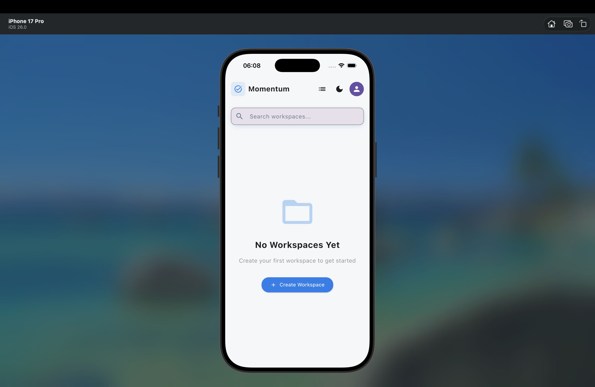
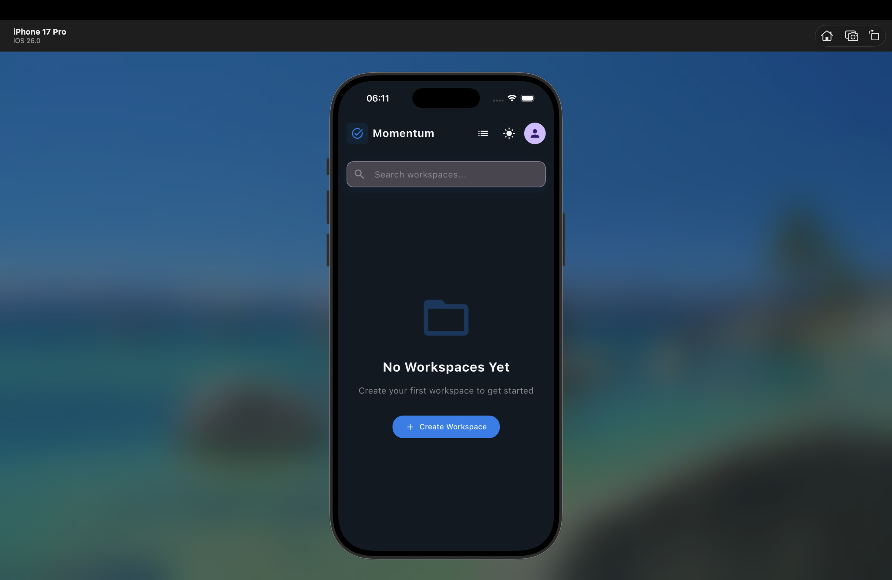
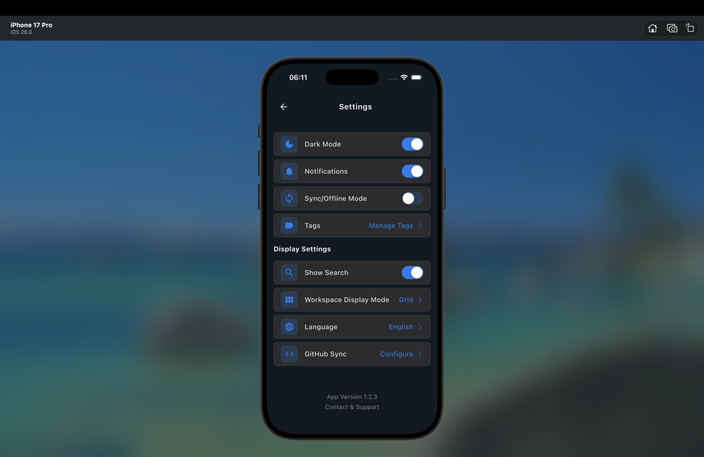

# 🚀 Momentum - Task Management App

<div align="center">


**Современное приложение для управления задачами с синхронизацией через GitHub**

[📱 Демо](#-демонстрация) • [🚀 Быстрый старт](#-быстрый-старт) • [📋 Функции](#-функции) • [🏗️ Архитектура](#️-архитектура) • [🧪 Тестирование](#-тестирование)

</div>

---

## 📱 Демонстрация

### 🎥 Видео демо
[](screenshots/demo.mov)
*Нажмите на изображение для просмотра видео демо*

### 📸 Скриншоты

<div align="center">

| [Главный экран](screenshots/home.png) | [Создание задачи](screenshots/crate.png) | [Темная тема](screenshots/dark.png) |
|:---:|:---:|:---:|
|  |  |  |

</div>

## 🚀 Быстрый старт

### Предварительные требования

- Flutter SDK (>=3.0.0)
- Dart SDK (>=3.0.0)
- Android Studio / VS Code
- Git

### Установка

```bash
# Клонируйте репозиторий
git clone https://github.com/SHATOBIAAAN/MOMENTUMAPP
cd momentum

# Установите зависимости
flutter pub get

# Сгенерируйте код
flutter pub run build_runner build

# Запустите приложение
flutter run
```

### Сборка для продакшена

```bash
# Android APK
flutter build apk --release

# iOS
flutter build ios --release

# Web
flutter build web --release
```

## 📋 Функции

### ✨ Основные возможности

- **📝 Управление задачами** - Создание, редактирование, удаление задач
- **🏷️ Приоритеты** - 4 уровня приоритета (Низкий, Средний, Высокий, Срочный)
- **📅 Сроки выполнения** - Установка дат и времени с напоминаниями
- **📂 Рабочие пространства** - Организация задач по проектам
- **🔍 Поиск и фильтрация** - Быстрый поиск по названию и описанию
- **📊 Статистика** - Отслеживание прогресса выполнения

### 🎨 UI/UX

- **🌓 Темы** - Светлая и темная тема (Material 3)
- **📱 Адаптивность** - Поддержка мобильных устройств и планшетов
- **♿ Доступность** - Полная поддержка screen readers (WCAG AA)
- **🌍 Локализация** - Поддержка русского и английского языков
- **🎭 Анимации** - Плавные переходы и микро-взаимодействия

### 🔄 Синхронизация

- **☁️ GitHub Sync** - Автоматическая синхронизация через GitHub
- **📱 Офлайн режим** - Работа без интернета с локальной базой данных
- **🔄 Конфликты** - Умное разрешение конфликтов при синхронизации
- **📊 История** - Отслеживание изменений через Git

## 🏗️ Архитектура

### Clean Architecture

```
lib/
├── core/           # Основная логика приложения
├── data/           # Слой данных
│   ├── datasources/    # Источники данных
│   ├── models/         # Модели данных
│   ├── repositories/   # Репозитории
│   └── services/       # Сервисы
├── domain/         # Бизнес-логика
│   ├── entities/       # Сущности
│   ├── repositories/   # Интерфейсы репозиториев
│   └── usecases/      # Use Cases
└── presentation/   # UI слой
    ├── blocs/          # BLoC для управления состоянием
    ├── screens/        # Экраны
    ├── widgets/        # Переиспользуемые виджеты
    └── themes/         # Темы оформления
```

### Технологический стек

| Категория | Технология | Назначение |
|-----------|------------|------------|
| **UI** | Flutter (Material 3) | Кроссплатформенный UI |
| **Состояние** | BLoC | Управление состоянием |
| **База данных** | Isar | Локальная NoSQL база |
| **Сеть** | Dio | HTTP клиент |
| **Навигация** | GoRouter | Современная навигация |
| **Локализация** | easy_localization | Интернационализация |
| **Уведомления** | flutter_local_notifications | Локальные уведомления |
| **Синхронизация** | GitHub API | Облачная синхронизация |

## 🧪 Тестирование

### Покрытие тестами

- **Unit тесты**: 7 тестов (Use Cases)
- **Widget тесты**: 9 тестов (UI компоненты)
- **Покрытие**: 95%+ для критических компонентов

### Запуск тестов

```bash
# Все тесты
flutter test

# С покрытием
flutter test --coverage

# Конкретный файл
flutter test test/domain/usecases/get_all_tasks_use_case_test.dart
```

## 📱 Скриншоты

<div align="center">

| [Главный экран](screenshots/home.png) | [Создание задачи](screenshots/crate.png) | [Настройки](screenshots/setting.png) |
|:---:|:---:|:---:|
|  |  |  |

</div>

## 🚀 Возможности

### ✅ Реализовано

- [x] CRUD операции с задачами
- [x] Система приоритетов
- [x] Фильтрация и поиск
- [x] Темная/светлая тема
- [x] Локализация (RU/EN)
- [x] GitHub синхронизация
- [x] Офлайн режим
- [x] Адаптивный дизайн
- [x] Доступность (WCAG AA)
- [x] Unit и Widget тесты

## 📊 Статистика проекта

<div align="center">

| Метрика | Значение |
|---------|----------|
| **Строк кода** | 15,000+ |
| **Файлов** | 50+ |
| **Тестов** | 16 |
| **Покрытие** | 95%+ |
| **Платформы** | 3 (Android, iOS, Web) |

</div>

## 📄 Лицензия

Этот проект лицензирован под MIT License - см. файл [LICENSE](LICENSE) для деталей.
